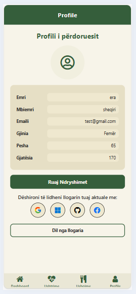
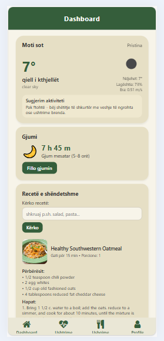

# Personal Health Tracker App
- Personal Health Tracker është një aplikacion mobil që i ndihmon përdoruesit të ndjekin dhe menaxhojnë rutinën e tyre të shëndetit ditor, duke i motivuar drejt një stili më të shëndetshëm jetese.
----------------------------------------------------------------------------------------------------------
###  Anëtarët e grupit:
- Era Sheqiri
- Aurore Smirqaku  
- Artin Dulahi
- Emir Bislimi
- Ulp Bellaqa

---
### Dashboard inteligjent
Dashboard-i shfaq përmbledhjen ditore të aktivitetit të përdoruesit dhe përdor lokacionin aktual, hartën dhe API për motin, duke e personalizuar përvojën sipas vendndodhjes së secilit përdorues.

### Plane ushqimore të personalizuara (Meal Screen)
Përdoruesi mund të zgjedhë mes tre planeve ushqimore:
Humbje peshe
Shtim peshe
Mirëmbajtje peshe
Planet janë të përshtatura për nevojat dhe qëllimet individuale.

### Ushtrime për shtëpi dhe palestër (Home Workout Screen)
Aplikacioni ofron ushtrime të strukturuara si për përdorim në shtëpi, ashtu edhe për weight lifting në palestër, duke i përshtatur për rutina të ndryshme fizike.

### Profili i përdoruesit
Përdoruesi mund të:
Ndryshojë fotografinë e profilit përmes expo-image-picker
Përditësojë të dhënat personale
Aktivizojë ose çaktivizojë njoftimet (notifications) për rutina dhe aktivitete ditore

### Autentifikim dhe siguri
Implementohet autentifikimi me Firebase Authentication, duke përfshirë email/password dhe login social. Pas hyrjes, përdoruesi ridrejtohet automatikisht në ekranin kryesor dhe mund të kryejë logout në çdo kohë.

### Menaxhimi i të dhënave (CRUD)
Aplikacioni përdor Firebase Firestore për ruajtjen dhe menaxhimin e të dhënave dinamike, duke mundësuar shtimin, leximin, përditësimin dhe fshirjen e të dhënave shëndetësore.

### Device features & optimizim performance
Përdoren funksionalitete të pajisjes si GPS/Location, Camera/Image Picker dhe Local Notifications, të kombinuara me optimizime si FlatList, React.memo, useCallback dhe useMemo për një përvojë të qëndrueshme dhe të shpejtë.

### Navigim dhe UI/UX
Navigimi realizohet me Expo Router, ndërsa UI është i dizajnuar me ngjyra të njëtrajtshme, animacione të lehta dhe layout të qartë për përdorim intuitiv.

---------------------------------------------------------------


## Screenshots

### Admin View
<p align="center">
  
  
  
  
</p>
### User View
<p align="center">
  
  
  
  
</p>
<p align="center">
  
  
  
    
    
</p>

##  Features (të zgjeruara)

###  Authentication & User Security
- Firebase Email/Password  
- Social Logins (Web): Google, Microsoft, GitHub, Facebook  
- Session Persistence (përdoruesi mbetet i kyçur edhe pas restart)  

---

###  State Management & Logic
- `useState`, `useEffect`, `useRouter`  
- Handling errors, loading, async operations  
- Data sync me Firebase Firestore

  ---
###  Food Tracking
- Regjistrim i vakteve ditore  
- Llogaritje automatike e kalorive  
- Shfaqje nutriente: protein, carbs, fats  
- Skanim i barkodit ushqimor *(opsionale në të ardhmen)*  

---
###  Workout Tracking
- Regjistrim i ushtrimeve ditore  
- Kalori të djegura  
- Plane ushtrimesh sipas qëllimit  

- 
###  Sleep Monitoring
- Orët e gjumit  
- Kualiteti i gjumit  
---

###  Recipes API Integration
- TheMealDB  
- OpenWeatherMap (+rekomandime sipas motit)  
  
###  Navigation (expo-router)
- Layout i pastër  
- Navigim i thjeshtë për çdo moshë  
- Bottom Tabs + Stack Navigation  

---

##  UI/UX Improvements

### Layout dhe Dizajn i Pastër
- **Ngjyra të njëtrajtshme**: Përdorim i konstantave të centralizuara për ngjyrat (COLORS) në të gjithë aplikacionin, duke siguruar konsistencë vizuale.
- **Spacing dhe Padding**: Konstantat e centralizuara (SPACING) për hapësira uniforme, duke përmirësuar lexueshmërinë dhe dizajnin e pastër.
- **Stilizim i njëtrajtshëm**: Aplikimi i stileve të përbashkëta në komponente si karta, butona dhe tekste, duke përdorur React Native StyleSheet me konstante.

### Animacione
- **Button Press**: Zëvendësimi i butonave standard me `AnimatedButton` (bazuar në `TouchableOpacity` me `activeOpacity` për efekt fade), duke siguruar feedback vizual gjatë shtypjes.
- **Modal me Fade-in/out**: Komponenti `Modal` i personalizuar me animacione fade për hapje dhe mbyllje, duke përmirësuar përvojën e përdoruesit.
- **Animacion në Përfundim të Detyrave**: Përdorim i modalit të suksesit me animacion fade për konfirmimin e veprimeve (p.sh., ruajtja e vakteve), duke motivuar përdoruesin me feedback të qartë.

Këto përmirësime janë aplikuar në ekrane kryesore si `PlanMealsScreen`, `login`, `signup`, dhe komponente të ripërdorshme si `AnimatedButton` dhe `Modal`. Aplikacioni tani ka një ndjesi më moderne dhe të rrjedhshme, me performancë të optimizuar përmes memoizimit (useMemo, useCallback, React.memo).

---

| Shtresa | Teknologjia |
|--------|-------------|
| Frontend | React Native (Expo) |
| Routing | expo-router |
| Backend | Firebase Firestore |
| Auth | Firebase Authentication |
| Hosting (Web) | Firebase Hosting |
| API External | TheMealDB, OpenWeatherMap |
| State | React Hooks |

---


##  Install & Run

```bash
git clone <repo-url>
cd myApp
npm install
npm run web
```

Hapeni me:
- **Web (Browser)**


  ##  Testing
Për fazën e testimit kemi përdorur Jest dhe React Testing Library.
- Snapshot Tests: Verifikojnë që UI nuk ndryshon papritur.
- Interaction Tests: Testimi i shtypjes së butonave (fireEvent).
- Mocking: Kemi bërë mock Firebase-in për të simuluar Auth dhe Firestore.

Udhëzimi për testim:
Run `npm test`
