# Personal Health Tracker App
- Personal Health Tracker është një aplikacion mobil që i ndihmon përdoruesit të ndjekin dhe menaxhojnë rutinën e tyre të shëndetit ditor, duke i motivuar drejt një stili më të shëndetshëm jetese.
----------------------------------------------------------------------------------------------------------
###  Anëtarët e grupit:
- Era Sheqiri
- Aurore Smirqaku  
- Artin Dulahi
- Emir Bislimi
- Ulp Bellaqa

---
### Dashboard inteligjent
Dashboard-i shfaq përmbledhjen ditore të aktivitetit të përdoruesit dhe përdor lokacionin aktual, hartën dhe API për motin, duke e personalizuar përvojën sipas vendndodhjes së secilit përdorues.

### Plane ushqimore të personalizuara (Meal Screen)
Përdoruesi mund të zgjedhë mes tre planeve ushqimore:
Humbje peshe
Shtim peshe
Mirëmbajtje peshe
Planet janë të përshtatura për nevojat dhe qëllimet individuale.

### Ushtrime për shtëpi dhe palestër (Home Workout Screen)
Aplikacioni ofron ushtrime të strukturuara si për përdorim në shtëpi, ashtu edhe për weight lifting në palestër, duke i përshtatur për rutina të ndryshme fizike.

### Profili i përdoruesit
Përdoruesi mund të:
Ndryshojë fotografinë e profilit përmes expo-image-picker
Përditësojë të dhënat personale
Aktivizojë ose çaktivizojë njoftimet (notifications) për rutina dhe aktivitete ditore

### Autentifikim dhe siguri
Implementohet autentifikimi me Firebase Authentication, duke përfshirë email/password dhe login social. Pas hyrjes, përdoruesi ridrejtohet automatikisht në ekranin kryesor dhe mund të kryejë logout në çdo kohë.

### Menaxhimi i të dhënave (CRUD)
Aplikacioni përdor Firebase Firestore për ruajtjen dhe menaxhimin e të dhënave dinamike, duke mundësuar shtimin, leximin, përditësimin dhe fshirjen e të dhënave shëndetësore.

### Device features & optimizim performance
Përdoren funksionalitete të pajisjes si GPS/Location, Camera/Image Picker dhe Local Notifications, të kombinuara me optimizime si FlatList, React.memo, useCallback dhe useMemo për një përvojë të qëndrueshme dhe të shpejtë.

###  Testing
Për fazën e testimit kemi përdorur Jest dhe React Testing Library.
- Snapshot Tests: Verifikojnë që UI nuk ndryshon papritur.
- Interaction Tests: Testimi i shtypjes së butonave (fireEvent).
- Mocking: Kemi bërë mock Firebase-in për të simuluar Auth dhe Firestore.
- Udhëzimi për testim: Run `npm test`

### Navigim dhe UI/UX
Navigimi realizohet me Expo Router, ndërsa UI është i dizajnuar me ngjyra të njëtrajtshme, animacione të lehta dhe layout të qartë për përdorim intuitiv.

---------------------------------------------------------------
##  Install & Run

```bash
git clone <https://github.com/erasheqiri1/Personal-Health-Tracker-11.git>
cd myApp
npm install
npx expo start
```
----------------------------------
### Teknologjite e perdorura
| Component            | Technology |
|---------------------|------------|
| Frontend            | React Native |
| Framework            | Expo |
| Routing              | Expo Router |
| Programming Language | JavaScript (ES6) |
| Backend              | Firebase Firestore |
| Authentication       | Firebase Authentication |
| State Management     | React Hooks / Context API |
| Maps & Location      | React Native Maps, Expo Location |
| Notifications        | Expo Notifications |
| Image Picker         | Expo Image Picker |
| Local Storage        | AsyncStorage |
| IDE                  | Visual Studio Code |
| Version Control      | Git & GitHub |


## Screenshots

### Admin View
<p align="center">
  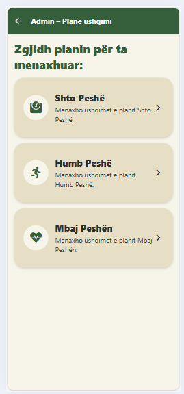
  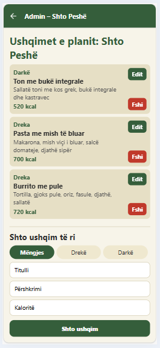
  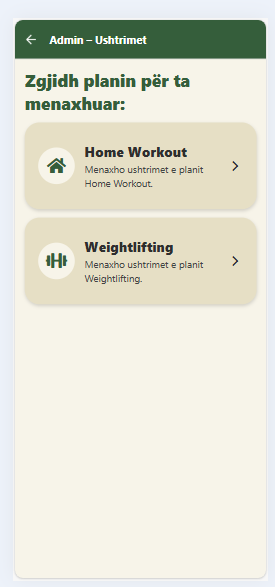
  
</p>

### User View
<p align="center">
  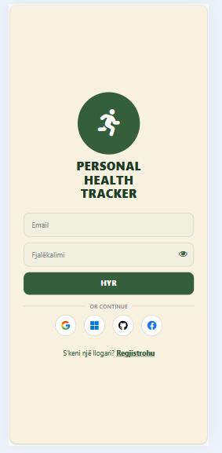
  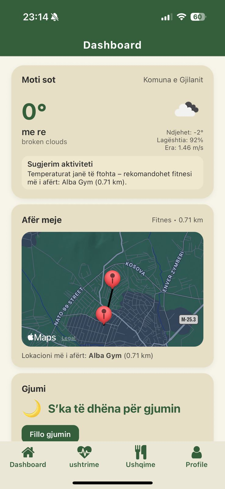
  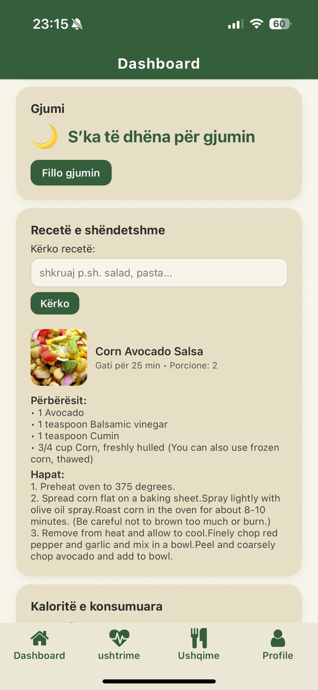
  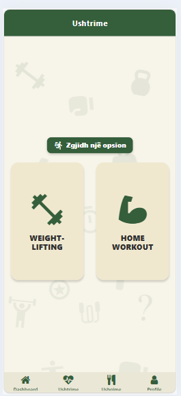
</p>
<p align="center">
  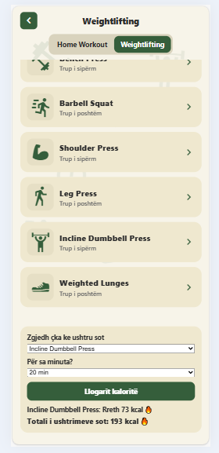
  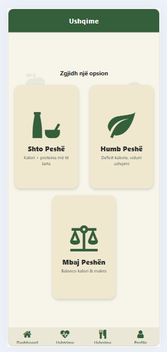
  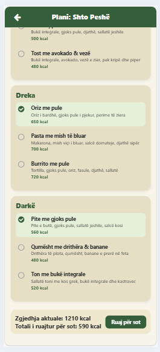
  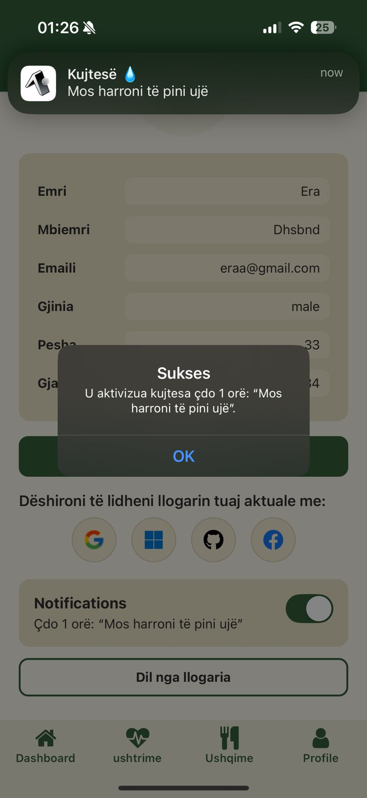
  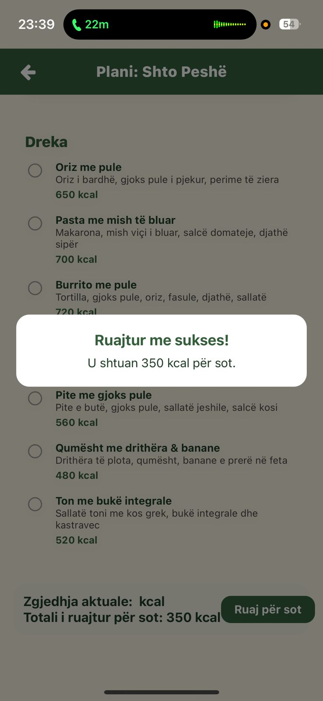

</p>


